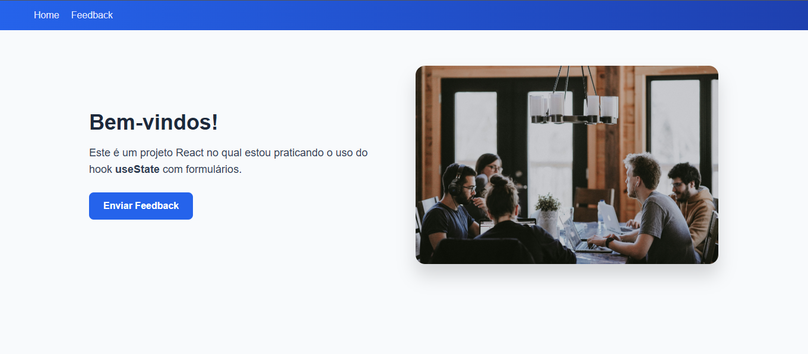

# 📋 Projeto Feedback Form - React

Este projeto foi desenvolvido com o objetivo de praticar os conceitos fundamentais do **React**, com foco no uso do hook **useState** para criação de formulários interativos, dinâmicos e responsivos.

---

## 🖼️ Preview do Projeto




---

## 🎯 Objetivo do Projeto

- Praticar o uso do hook `useState`
- Criar formulários controlados
- Implementar validações simples
- Exibir feedback visual ao usuário
- Trabalhar com componentes funcionais
- Criar um layout moderno e responsivo
- Simular um projeto real de front-end

---

## 🖥️ Demonstração

O projeto possui:

- Página **Home** (apresentação)
- Página **Feedback** com formulário interativo
- Mensagem visual de sucesso após envio do formulário
- Navegação entre páginas sem recarregamento (SPA)

---

## 🚀 Tecnologias Utilizadas

- React
- JavaScript (ES6+)
- React Router DOM
- HTML5
- CSS3 (Flexbox e Grid)
- Git & GitHub

---

## 📱 Responsividade

O projeto foi desenvolvido com foco em **responsividade**, garantindo uma boa experiência em diferentes tamanhos de tela:

- Layout adaptável para **desktop**
- Ajustes automáticos para **tablets**
- Interface otimizada para **dispositivos móveis**
- Uso de **CSS Grid**, **Flexbox** e **Media Queries**

Exemplo de breakpoint utilizado:

```css
@media (max-width: 780px) {
  .home {
    grid-template-columns: 1fr;
    text-align: center;
  }
}
